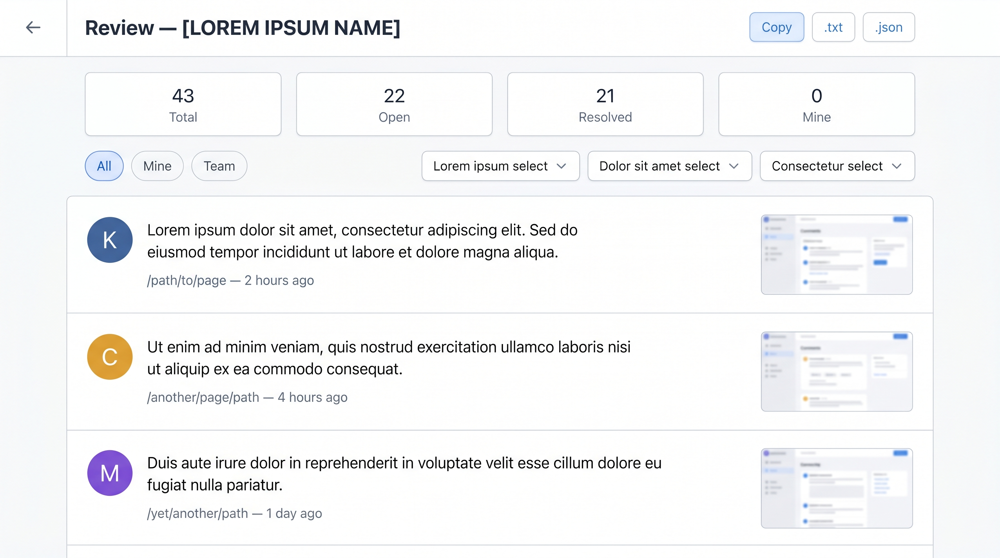
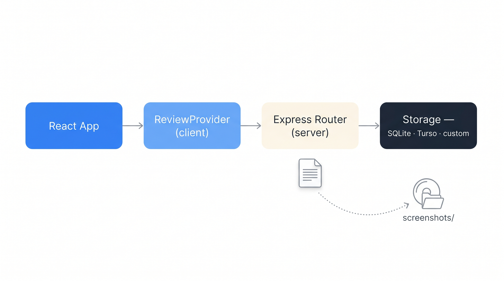

# web-annotate-kit

> **A proofing tool for live websites.** Your team clicks anywhere on the site, drops a comment at that exact pixel, and it's saved with an automatic screenshot plus full DOM context.


## What problem it solves

Most websites are reviewed by people who aren't developers — directors, content writers, brand managers, agency clients. Today they send feedback via email, WhatsApp or PDFs with red arrows. The developer then copies that into tickets, tries to figure out which paragraph they meant, iterates, and sends a new screenshot back for approval. Friction at every step, context lost every time.

**web-annotate-kit replaces that loop with a single place.** Anyone on the team with a password opens your site — staging or production — clicks the **+** button at the bottom-right, and drops a colored pin anywhere: literally on the headline that should change, on the image that's too big, on the button with the wrong copy. They write a short note. It's saved instantly. Everyone else sees it when they log in.

## What each pin actually captures

Every comment is anchored to **percent-x + page-y** (so it survives responsive reflows and layout shifts), and the server stores:

- An **automatic PNG screenshot** of what the reviewer was seeing at the moment of the click, with a red marker drawn at the pin location.
- The **DOM context**: nearest `<section>` heading, the enclosing tag name, up to 120 characters of surrounding text, and a short CSS selector path.
- **Author, color, timestamp, status** (open / resolved), and optional edit history.

A companion **dashboard** aggregates every pin across every URL of your site, filterable by reviewer, page or status. One click exports to `.txt` (ready to paste into an LLM — "turn these into a punchlist") or `.json` for tooling.

## Typical use cases

- A **design agency** collecting client feedback on a staging site before launch
- A **content team** proofing article copy after publishing
- A **director or copywriter** reviewing a new landing page and pointing at exact words to rewrite
- A **brand manager** spotting rendering issues and inconsistencies across desktop and mobile
- **Stakeholders** giving structured feedback on a live prototype without needing Figma
- **QA** pairing visual bugs with exact DOM selectors for the engineer to fix

It fits any React app with an Express backend. Pluggable storage means you can run it with a single-file SQLite for a weekend project or with Turso (hosted libsql) for a distributed team.

---

## Features

- **Pin comments** anchored by percent-x + pixel-y so they stick even as the layout shifts.
- **Automatic screenshots** via the Screen Capture API — the reviewer clicks **Allow**, a red marker is drawn on the capture, done.
- **DOM context** captured with each comment: nearest `<section>` heading, enclosing tag, truncated text nearby, CSS selector path.
- **Dashboard view** aggregating every pin across every URL, filterable by author, page, status.
- **Export** to `.txt` (prompt-ready for LLM handoff) or `.json`.
- **Pluggable storage**: SQLite (zero-setup), Turso (hosted), or write your own adapter.
- **Rate-limited login** with exponential backoff stored in `localStorage`.
- **Framework-agnostic routing**: default tracks `window.location.pathname`; pass your router's pathname for perfect integration.

---

## Install

```bash
npm install web-annotate-kit
# Pick one backend
npm install better-sqlite3          # for SQLite storage
# or
npm install @libsql/client          # for Turso storage

# Peer deps (likely already installed)
npm install react react-dom express
```

---

## Quick start

### 1. Mount the server router and seed your team

```js
// server.js
import express from 'express';
import { createReviewRouter, seedIfEmpty, sqliteStorage } from 'web-annotate-kit/server';

const app = express();
const storage = await sqliteStorage({ path: './reviews.db' });

// Idempotent: only writes when the tables are empty.
await seedIfEmpty(storage, {
  departments: [
    { id: 'design',      name: 'Design',      color: '#A855F7' },
    { id: 'linguistics', name: 'Linguistics', color: '#10B981' },
  ],
  users: [
    { id: 'alice',  name: 'Alice', password: 'alice-pass', color: '#3B82F6', role: 'admin' },
    { id: 'diana',  name: 'Diana', password: 'diana-pass', color: '#EF4444', role: 'director' },
    { id: 'leo',    name: 'Leo',   password: 'leo-pass',   color: '#A855F7', role: 'lead', departmentId: 'design' },
    { id: 'rita',   name: 'Rita',  password: 'rita-pass',  color: '#F59E0B', role: 'reviewer' },
  ],
});

app.use('/api', createReviewRouter({
  storage,
  apiKey: process.env.REVIEW_API_KEY,
  sessionSecret: process.env.REVIEW_SESSION_SECRET, // mandatory; ≥16 chars; must NOT equal apiKey
  screenshotsDir: './screenshots',
  express,
}));

app.use('/screenshots', express.static('./screenshots'));
app.listen(3001);
```

Once seeded you can manage the org (add users, change roles, create departments) from the in-app **Admin panel** as any admin user — no need to redeploy.

### 2. Wrap your React app

```tsx
// main.tsx
import {
  ReviewProvider, ReviewOverlay, ReviewDashboard, ReviewAdmin, ReviewLogin, useReview,
} from 'web-annotate-kit/client';

function Gate({ children }) {
  const { user } = useReview();
  if (!user) return <ReviewLogin brand="Acme" />;
  return <>{children}<ReviewOverlay /></>;
}

<ReviewProvider apiKey={import.meta.env.VITE_REVIEW_API_KEY}>
  <Gate><YourApp /></Gate>
</ReviewProvider>
```

That's it. Users log in with their password (the server validates against the seeded/managed list and issues a signed HttpOnly session cookie). Click the **+** button at the bottom right to drop a pin.

---

## Roles and permissions

The kit ships with four roles. Permissions are enforced server-side and mirrored in the UI.

| Action | Reviewer | Lead | Director | Admin |
|---|---|---|---|---|
| Create pin | ✓ | ✓ | ✓ | ✓ |
| Add a note ("addendum") to any pin | ✓ | ✓ | ✓ | ✓ |
| Edit / delete own pin | ✓ | ✓ | ✓ | ✓ |
| Edit / delete others' pins | ✗ | ✗ | ✓ | ✓ |
| **Accept** (escalate to director) | ✗ | own dept + general | ✓ | ✓ |
| **Resolve** (close / executed) | ✗ | ✗ | ✓ | ✓ |
| Manage users + departments | ✗ | ✗ | ✗ | ✓ |

**Lifecycle:** `open` → (lead) `accepted` → (director) `resolved`. A `lead` only escalates within their own department or `general`; everything else they see read-only (but can still annotate). The director uses the dashboard's "Escalated" filter as their inbox.

### Departments

Pins carry a `department` id (default `general`). When a reviewer drops a pin they pick the target department from a dropdown. The lead of that department gets it in their dashboard (mixed with `general`).

---

## The dashboard



A dedicated page at any path you choose (default `/review`) shows every comment across the site. The default view is **role-aware**:

- **Reviewer / admin** → all open comments.
- **Lead** → comments addressed to their department + general, status = open.
- **Director** → escalation **inbox** (status = accepted), pending resolution.

Filter further by reviewer, page, status or department. Export to `.txt` (LLM-friendly) or `.json`.

```tsx
import { ReviewDashboard, ReviewAdmin } from 'web-annotate-kit/client';

<Route path="/review"        element={<ReviewDashboard title="Acme review" />} />
<Route path="/review/admin"  element={<ReviewAdmin title="Acme admin" />} />
```

The admin route is only useful for users with `role: 'admin'`; it's where you create/edit users and departments without redeploying.

---

## Storage adapters

All three implement the same `ReviewStorage` interface. Pick one and pass it to `createReviewRouter`.

### SQLite (zero-setup, single machine)

```js
import { sqliteStorage } from 'web-annotate-kit/server';
const storage = await sqliteStorage({ path: './reviews.db' });
```

### Turso (hosted libsql, shared across machines)

```js
import { tursoStorage } from 'web-annotate-kit/server';
const storage = await tursoStorage({
  url: process.env.TURSO_URL,
  authToken: process.env.TURSO_AUTH_TOKEN,
});
```

### In-memory (tests, demos only)

```js
import { memoryStorage } from 'web-annotate-kit/server';
const storage = memoryStorage();
```

### Custom

Implement the interface from `web-annotate-kit/server`:

```ts
interface ReviewStorage {
  list(): Promise<ReviewRecord[]>;
  insert(record: ReviewRecord): Promise<void>;
  updateText(id: string, text: string, updatedAt: string): Promise<void>;
  updateScreenshot(id: string, screenshotUrl: string): Promise<void>;
  toggleResolved(id: string): Promise<void>;
  delete(id: string): Promise<string | null>; // returns screenshot URL to clean up
}
```

Postgres, MySQL, DynamoDB, plain JSON file — all fair game.

---

## Architecture



Screenshots are stored as PNG files on the server filesystem; only the URL is kept in the DB.

---

## Distributed setup (dev ↔ prod sync)

If your team comments on a live URL (e.g. `staging.example.com`) but you also run a local dev server against the same database, screenshots end up split between the two filesystems. The router has an optional `mirror` config that turns the dev server into a **pull-through cache** and **write-through mirror** to production.

```js
app.use('/api', createReviewRouter({
  storage,
  apiKey: process.env.REVIEW_API_KEY,
  screenshotsDir: './screenshots',
  express,
  mirror: process.env.NODE_ENV !== 'production' ? {
    baseUrl: 'https://staging.example.com',
    apiKey: process.env.REVIEW_API_KEY,
    timeoutMs: 5000,
  } : undefined,
}));
```

- Uploads on dev → also POSTed to prod (fire-and-forget, 5s timeout).
- Misses on `GET /screenshots/:id` → pulled from prod and cached locally.
- Guarded so the production server never mirrors to itself.

---

## Security model

**Honest disclosure — read before deploying:**

- Passwords are hashed with **scrypt** server-side (Node native, no extra deps).
- Authentication issues an **HTTP-only signed session cookie** (HMAC-SHA256). The cookie is unreadable from JS, so XSS can't steal it. The signing key is `sessionSecret` (mandatory, ≥16 chars, must NOT equal `apiKey` — `apiKey` ships in the client bundle; reusing it would let anyone forge sessions). Generate with `openssl rand -hex 32`.
- Permissions are enforced server-side from the session — a reviewer can't curl-delete others' pins; a lead can't accept comments outside their department.
- The `apiKey` is still embedded in the client bundle (used only for the login endpoint). It's the gate to the password form, not the gate to the data.
- Client-side rate-limit on failed logins lives in `localStorage` (easy to bypass). Add `express-rate-limit` server-side for hostile traffic.
- `safeFilename` sanitizes screenshot IDs to block path traversal.

---

## API reference

### `<ReviewProvider>` props

| Prop | Default | Notes |
|---|---|---|
| `apiKey` | required | Sent as `X-API-Key` on the login endpoint. Must match the server. |
| `apiBase` | `"/api"` | Base URL of the API. |
| `captureScreenshots` | `true` | Set `false` to disable the screenshot flow. |
| `pollIntervalMs` | `10000` | How often to re-fetch comments. |
| `screenshotTimeoutMs` | `8000` | Abort the screenshot capture after this many ms. |
| `storageKeyPrefix` | `"wak"` | Prefix for all `localStorage` keys. |
| `resolvedOpacity` | `0.45` | Opacity for resolved comment cards in lists. |
| `resolvedPinOpacity` | `0.28` | Opacity for resolved pins on the page (non-active). Hover reveals to 1. |

> **0.3.0 breaking change.** `users` is no longer a Provider prop — users live server-side now. Seed them once with `seedIfEmpty` and manage them from the in-app admin panel.

### `<ReviewOverlay>` props

All optional. Accepts `currentPath`, `dashboardPath`, `adminPath`, `hidePinsOn`, `LinkComponent`, `accentColor`.

### `<ReviewDashboard>` props

Accepts `LinkComponent`, `homePath`, `accentColor`, `title`.

### `<ReviewAdmin>` props

Accepts `LinkComponent`, `homePath`, `accentColor`, `title`. Renders an "Admin only" stub for non-admin users — safe to mount unconditionally.

### `useReview()` returns

`user`, `comments`, `departments`, `users` (admin-only, lazy via `refreshUsers()`), `login(password)`, `logout()`, `addComment`, `updateComment`, `deleteComment`, `resolveComment`, **`acceptComment`** (lead/director/admin), **`addNote(id, text)`** (any authenticated user), `exportComments`, `exportCompact`.

### `createReviewRouter(options)`

`storage` (object: `{ reviews, users, departments }`), `apiKey`, `sessionSecret`, `sessionTtlDays`, `cookieName`, `cookieSecure`, `screenshotsDir`, `express`, optional `jsonLimit`, `mirror`, `onInsert`.

### `seedIfEmpty(storage, { departments, users })`

Idempotent helper — only writes when the corresponding tables are empty. Use it to bootstrap the first admin and the initial set of departments at boot.

---

## Run the demo

```bash
git clone <this-repo>
cd web-annotate-kit/example
npm install
npm run dev
# open http://localhost:5180
```

Demo passwords (each role / department combo):
- `alice` — admin
- `diana` — director
- `leo` — lead of Design
- `lena` — lead of Linguistics
- `rita`, `rob` — reviewers

You'll get two sample pages, a role-aware dashboard, an admin panel, and a SQLite file at `example/data/reviews.db`.

---

## License

MIT © Mario Hernández
